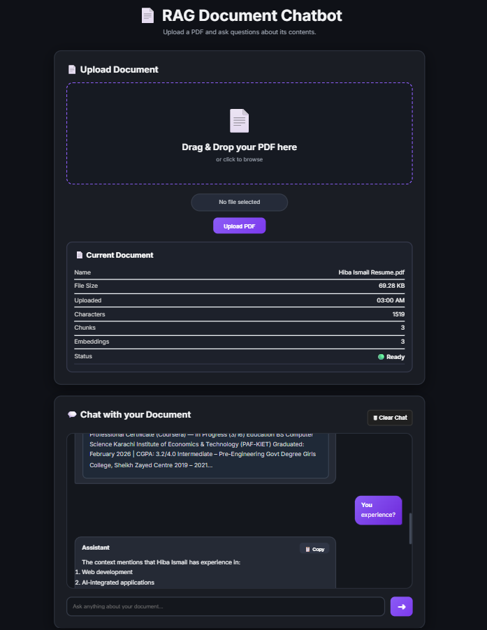

# 📄 RAG Document Chatbot

> AI-powered document question answering system built with **Flask**, **FAISS**, **Sentence Transformers**, and **Groq LLM**.

Ask questions about any PDF using Retrieval-Augmented Generation (RAG). The application extracts text from uploaded documents, creates semantic embeddings, retrieves the most relevant context using FAISS, and generates accurate answers with a Large Language Model.

---


## 🚀 Preview

<p align="center">
  
</p>

## ✨ Features

- 📄 Upload and process PDF documents
- 💬 Ask natural language questions about uploaded documents
- 🧠 Retrieval-Augmented Generation (RAG) pipeline
- 🔍 Semantic search using FAISS vector database
- 🤖 AI-powered answers using Groq LLM
- 📝 Markdown-formatted responses
- 📚 Expandable source references for answer transparency
- 📋 One-click copy response button
- 🎨 Modern responsive dark UI
- ⚡ Fast document retrieval with Sentence Transformers embeddings
- 📊 Document statistics (chunks, embeddings, characters, upload time)
- 🖱️ Drag & Drop PDF upload support
- 🔔 Toast notifications and loading indicators

## 🛠️ Tech Stack

### Backend
- Python 3
- Flask

### AI / Machine Learning
- Groq API (LLM)
- Sentence Transformers
- FAISS (Vector Database)
- Retrieval-Augmented Generation (RAG)

### Frontend
- HTML5
- CSS3
- JavaScript

### Libraries
- PyPDF
- NumPy
- Markdown (Marked.js)

### Development Tools
- PyCharm
- Git
- GitHub

## 🏗️ Project Architecture

```text
                    +----------------------+
                    |      User Uploads    |
                    |         PDF          |
                    +----------+-----------+
                               |
                               v
                    +----------------------+
                    |   PDF Text Extraction|
                    +----------+-----------+
                               |
                               v
                    +----------------------+
                    |   Text Chunking      |
                    +----------+-----------+
                               |
                               v
                    +----------------------+
                    | Sentence Transformers|
                    |    Embeddings        |
                    +----------+-----------+
                               |
                               v
                    +----------------------+
                    |   FAISS Vector Store |
                    +----------+-----------+
                               ^
                               |
                    User Question
                               |
                               v
                    +----------------------+
                    | Semantic Retrieval   |
                    +----------+-----------+
                               |
                               v
                    +----------------------+
                    |     Groq LLM         |
                    +----------+-----------+
                               |
                               v
                    +----------------------+
                    |  AI Generated Answer |
                    | + Source References  |
                    +----------------------+
```
### Workflow

1. The user uploads a PDF document.
2. Text is extracted from the PDF.
3. The document is split into overlapping chunks.
4. Sentence Transformers generate vector embeddings for each chunk.
5. Embeddings are indexed using FAISS.
6. When the user asks a question, the question is converted into an embedding.
7. FAISS retrieves the most relevant document chunks.
8. Retrieved context is sent to the Groq LLM.
9. The LLM generates a grounded response along with relevant source references.

## 📂 Project Structure

```text
RAG-Document-Chatbot/
│
├── services/
│   ├── embedding.py         # Generate text embeddings
│   ├── llm.py               # Groq LLM integration
│   ├── pdf_loader.py        # Extract text from PDFs
│   ├── retriever.py         # Retrieve relevant document chunks
│   ├── text_splitter.py     # Split documents into chunks
│   └── vector_store.py      # FAISS vector database
│
├── static/
│   ├── css/
│   │   └── style.css
│   ├── js/
│   │   ├── script.js
│   │   └── toast.js
│   └── images/
│       └── rag-chatbot.png
│
├── templates/
│   └── index.html
│
├── app.py
├── requirements.txt
├── .gitignore
└── README.md
```

## ⚙️ Installation

### 1. Clone the repository

```bash
git clone https://github.com/HibaIsmail6/RAG-Document-Chatbot.git
cd RAG-Document-Chatbot
```

### 2. Create a virtual environment

```bash
python -m venv .venv
```

### 3. Activate the virtual environment

**Windows**

```bash
.venv\Scripts\activate
```

**macOS / Linux**

```bash
source .venv/bin/activate
```

### 4. Install dependencies

```bash
pip install -r requirements.txt
```

### 5. Create a `.env` file

Create a `.env` file in the project root and add your Groq API key:

```env
GROQ_API_KEY=your_api_key_here
```
## ▶️ Running the Application

Start the Flask development server:

```bash
python app.py
```

Open your browser and visit:

```
http://127.0.0.1:5000
```

Upload a PDF and start asking questions about its contents.

## 💡 Usage

1. Upload a PDF document.
2. Wait for the document to be processed.
3. Ask questions in natural language.
4. View AI-generated answers with source references.
5. Copy responses with one click.
6. Upload another document anytime to start a new conversation.

## 🧠 What I Learned

Building this project strengthened my understanding of modern AI application development, including:

- Retrieval-Augmented Generation (RAG) architecture
- Semantic search using vector embeddings
- FAISS vector database for efficient document retrieval
- Sentence Transformers for text embeddings
- Prompt engineering for LLM-based question answering
- Flask backend development and REST APIs
- Frontend development with HTML, CSS, and JavaScript
- Error handling and user experience improvements
- Git and GitHub workflow for version control
- Writing clean, modular, and maintainable code

## 🚀 Future Improvements

Planned enhancements for future versions include:

- 📁 Support multiple PDF documents simultaneously
- 💬 Conversation memory across multiple questions
- ⚡ Streaming AI responses
- 📌 Highlight answer text inside the PDF
- 🔍 OCR support for scanned PDF documents
- 🌐 Deploy the application online
- 👤 User authentication and chat history
- 🐳 Docker support for easier deployment

## 👩‍💻 Author

**Hiba Ismail**

- 🎓 Bachelor of Computer Science
- 💻 Aspiring AI / Machine Learning Engineer

### Connect with me

- GitHub: https://github.com/HibaIsmail6
- LinkedIn: www.linkedin.com/in/hiba-ismail-406958250

