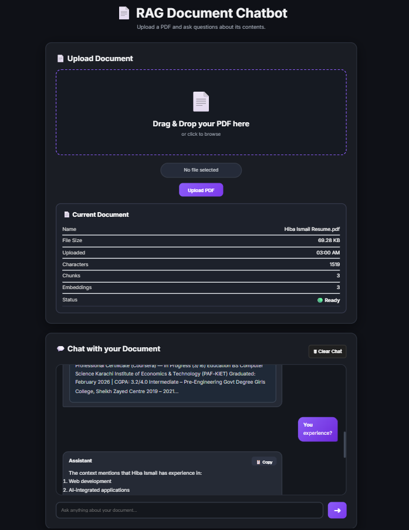

# 📄 RAG Document Chatbot

> AI-powered multi-document question answering system built with **Flask**, **FAISS**, **Sentence Transformers**, **CrossEncoder**, and **Groq LLM**.

Ask questions about one or multiple PDF documents using Retrieval-Augmented Generation (RAG). The application extracts and chunks document text, creates semantic embeddings, retrieves relevant candidates using FAISS, reranks them using a CrossEncoder, and generates grounded answers with a Large Language Model.

---


## 🚀 Preview

<p align="center">
  
</p>

## 🎯 Project Objective

The goal of this project is to demonstrate how Retrieval-Augmented Generation (RAG) can be used to build intelligent document question-answering systems.

Instead of relying solely on an LLM's general knowledge, the chatbot retrieves relevant information from uploaded documents using semantic search, reranks the retrieved content based on relevance, and generates grounded responses using the selected document context.

The system supports both **single-document** and **multi-document** question answering.

## ✨ Features

* 📄 Upload and process multiple PDF documents
* 💬 Ask natural language questions about uploaded documents
* 📚 Query a specific document or search across all uploaded documents
* 🧠 Retrieval-Augmented Generation (RAG) pipeline
* 🔍 Semantic search using FAISS vector search
* 🎯 CrossEncoder-based relevance reranking
* 🤖 AI-powered grounded answers using Groq LLM
* 📝 Markdown-formatted responses
* 📚 Expandable source references with document name, page, and section
* 📋 One-click copy response button
* 🎨 Modern responsive dark UI
* ⚡ Fast semantic retrieval using Sentence Transformers
* 📊 Document statistics including chunks, embeddings, characters, and upload time
* 🖱️ Drag & Drop PDF upload support
* 🔔 Toast notifications and loading indicators
* 🛡️ Grounded responses designed to reduce unsupported answers

## 🛠️ Tech Stack

### Backend

* Python 3.12
* Flask
* REST API

### AI / Machine Learning

* Groq API — LLM inference
* Sentence Transformers — semantic embeddings
* `all-MiniLM-L6-v2` — embedding model
* FAISS — vector similarity search
* CrossEncoder — relevance reranking
* `ms-marco-MiniLM-L-6-v2` — reranking model
* Retrieval-Augmented Generation (RAG)

### Frontend

* HTML5
* CSS3
* JavaScript
* Marked.js

### Core Libraries

* PyPDF
* NumPy
* LangChain Text Splitters

### Development Tools

* PyCharm
* Git
* GitHub

## 🏗️ Project Architecture

```text
                    +----------------------+
                    |      User Uploads    |
                    |    One or More PDFs  |
                    +----------+-----------+
                               |
                               v
                    +----------------------+
                    |   PDF Text Extraction|
                    +----------+-----------+
                               |
                               v
                    +----------------------+
                    |    Text Chunking     |
                    +----------+-----------+
                               |
                               v
                    +----------------------+
                    | Sentence Transformers|
                    |      Embeddings      |
                    +----------+-----------+
                               |
                               v
                    +----------------------+
                    |   FAISS Vector Store |
                    +----------------------+

                         User Question
                               |
                               v
                    +----------------------+
                    |  Question Embedding  |
                    +----------+-----------+
                               |
                               v
                    +----------------------+
                    |   FAISS Retrieval    |
                    |   Top Candidates     |
                    +----------+-----------+
                               |
                               v
                    +----------------------+
                    |     CrossEncoder     |
                    |      Reranking       |
                    +----------+-----------+
                               |
                               v
                    +----------------------+
                    |  Top Relevant Chunks |
                    +----------+-----------+
                               |
                               v
                    +----------------------+
                    |      Groq LLM        |
                    +----------+-----------+
                               |
                               v
                    +----------------------+
                    |  Grounded Answer +   |
                    |   Source References  |
                    +----------------------+
```

### Workflow

1. The user uploads one or more PDF documents.
2. Text is extracted from each PDF.
3. The extracted text is split into overlapping chunks.
4. Sentence Transformers generate vector embeddings for each chunk.
5. The embeddings are indexed using FAISS.
6. The user selects a specific document or **All Documents**.
7. The question is converted into an embedding.
8. FAISS retrieves the most relevant candidate chunks.
9. A CrossEncoder reranks the retrieved candidates based on question relevance.
10. The highest-ranked chunks are selected as context.
11. The selected context is sent to the Groq LLM.
12. The LLM generates a grounded response.
13. The application displays the answer together with document and page-level source references.

## 📚 Multi-Document Retrieval

The chatbot supports both single-document and multi-document question answering.

### Single Document

Users can select an individual uploaded PDF and ask questions specifically about that document.

```text
Question
   ↓
Selected Document
   ↓
FAISS Retrieval
   ↓
CrossEncoder Reranking
   ↓
Relevant Context
   ↓
Groq LLM
   ↓
Answer + Sources
```

### All Documents

Users can select **All Documents** to search across multiple uploaded PDFs.

The system retrieves candidate chunks from each document, combines them, and performs global CrossEncoder reranking before generating the final answer.

```text
                 Question
                    ↓
        ┌───────────┼───────────┐
        ↓           ↓           ↓
      PDF 1       PDF 2       PDF 3
        ↓           ↓           ↓
      FAISS       FAISS       FAISS
        └───────────┼───────────┘
                    ↓
          Combined Candidates
                    ↓
          CrossEncoder Reranking
                    ↓
           Top Relevant Chunks
                    ↓
                 Groq LLM
                    ↓
            Answer + Sources
```

Each retrieved chunk remains associated with its source document, allowing the application to display where the information came from.

## 📂 Project Structure

```text
RAG-Document-Chatbot/
│
├── services/
│   ├── embedding.py         # Generate text embeddings
│   ├── llm.py               # Groq LLM integration
│   ├── pdf_loader.py        # Extract text from PDFs
│   ├── retriever.py         # Retrieve relevant document chunks
│   ├── text_splitter.py     # Split documents into chunks
│   └── vector_store.py      # FAISS vector database
│
├── static/
│   ├── css/
│   │   └── style.css
│   ├── js/
│   │   ├── script.js
│   │   └── toast.js
│   └── images/
│       └── rag-chatbot.png
│
├── templates/
│   └── index.html
│
├── app.py
├── requirements.txt
├── .gitignore
└── README.md
```

## ⚙️ Installation

### 1. Clone the repository

```bash
git clone https://github.com/HibaIsmail6/RAG-Document-Chatbot.git
cd RAG-Document-Chatbot
```

### 2. Create a virtual environment

```bash
python -m venv .venv
```

### 3. Activate the virtual environment

**Windows**

```bash
.venv\Scripts\activate
```

**macOS / Linux**

```bash
source .venv/bin/activate
```

### 4. Install dependencies

```bash
pip install -r requirements.txt
```

### 5. Create a `.env` file

Create a `.env` file in the project root and add your Groq API key:

```env
GROQ_API_KEY=your_api_key_here
```

> Never commit your `.env` file or expose your API key publicly.

## ▶️ Running the Application

Start the Flask development server:

```bash
python app.py
```

Open your browser and visit:

```text
http://127.0.0.1:5000
```

Upload a PDF and start asking questions about its contents.

## 💡 Usage

1. Upload one or more PDF documents.
2. Wait for the documents to be processed.
3. Select a specific document or choose **All Documents**.
4. Ask questions in natural language.
5. View the AI-generated grounded answer.
6. Expand the source references to inspect the retrieved document text.
7. Copy responses with one click.
8. Upload additional PDFs and continue querying the document collection.

### Example

Suppose the following documents are uploaded:

```text
XYZ Resume.pdf
ABC Resume.pdf
```

The user can select:

```text
All Documents
```

and ask:

```text
What are the GPAs mentioned in the uploaded documents?
```

The system retrieves relevant education sections from the documents, reranks them using the CrossEncoder, and generates an answer based on the retrieved context.

The response also provides the source document and page associated with the retrieved information.

## 🧠 Grounding and Hallucination Control

The application uses a retrieval-first approach rather than sending entire documents directly to the LLM.

Only the highest-ranked document chunks are provided to the generation model.

The generation prompt instructs the model to:

* Use only the provided document context
* Avoid external knowledge
* Avoid guessing missing information
* Avoid inventing facts
* Keep information from different documents separate
* Identify relevant documents when information conflicts

If the requested information is not present in the retrieved context, the model is instructed to report that it could not find the information in the uploaded documents.

## 🧠 What I Learned

Building this project strengthened my understanding of modern AI application development, including:

* Retrieval-Augmented Generation (RAG) architecture
* Semantic search using vector embeddings
* FAISS vector search
* Sentence Transformers for text embeddings
* CrossEncoder-based reranking
* Multi-document retrieval and context aggregation
* Grounded generation and source attribution
* Prompt engineering for LLM-based question answering
* Flask backend development and REST APIs
* Frontend development with HTML, CSS, and JavaScript
* Error handling and user experience improvements
* Git and GitHub workflow for version control
* Writing clean, modular, and maintainable code

## ⚠️ Current Limitations

* PDF text extraction quality depends on the structure of the source PDF.
* Scanned or image-only PDFs may require OCR before their text can be retrieved effectively.
* Retrieval quality depends on chunking, embedding quality, and reranking.
* Large document collections may require a persistent and more scalable vector database.
* The LLM can only answer based on the context successfully retrieved by the RAG pipeline.

## 🚀 Future Improvements

Planned enhancements for future versions include:

* 📄 Support for DOCX and additional document formats
* 🔍 Improved retrieval evaluation and quality metrics
* 🌍 Multiple language support
* 📱 Further mobile UI improvements
* 📦 Docker deployment
* ☁️ Cloud deployment
* 🔐 User authentication and document-specific accounts
* 💾 Persistent vector database
* 📊 RAG evaluation using retrieval and answer-quality metrics

## 👩‍💻 Author

**Hiba Ismail**

* 🎓 Bachelor of Computer Science
* 💻 Aspiring AI / Machine Learning Engineer

### Connect with me

* GitHub: https://github.com/HibaIsmail6
* LinkedIn: [www.linkedin.com/in/hiba-ismail-406958250](http://www.linkedin.com/in/hiba-ismail-406958250)
